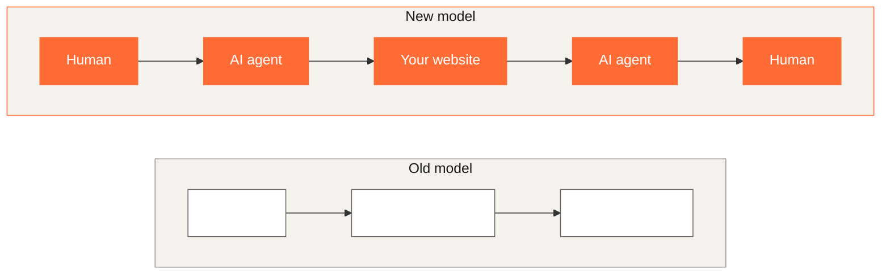

Last month, an AI agent booked a restaurant, compared insurance quotes, and filed a support ticket. It did all of this by browsing websites. Was your site one of them, or did the agent get confused and give up?

This isn't speculation. According to the Imperva Bad Bot Report 2025, 51% of internet traffic is now automated. Adobe Analytics data shows AI traffic to retail sites increased 1,300% year-over-year. The fastest-growing segment of your audience isn't human.

The intermediary model has shifted. The old flow was straightforward: a human searched Google, clicked a result, and landed on your site. The new flow adds a layer: a human asks an AI agent, the agent browses your site, extracts what it needs, and reports back. The agent becomes the user. Your site must work for them.



This article walks through a practical optimization ladder, from content changes you can make today to emerging protocols you should start watching. The techniques come from a talk I gave at the Ibexa Partner Event in February 2026, adapted here for a broader developer audience.

## Types of AI agents browsing the web

Four categories of AI agents interact with websites today, each with different needs.

**Conversational AI with browsing** includes ChatGPT, Claude, and Gemini. A user asks "Find me a hotel in Paris for next weekend," and the agent browses sites on their behalf. These are the most visible agents because users interact with them directly.

**Research and discovery engines** like Perplexity, You.com, and Phind synthesize information from multiple sources. Your content becomes their answer, and they cite sources when doing so.

**Automation agents** such as OpenAI Operator and Anthropic's computer use tools complete multi-step tasks autonomously. They click buttons, fill forms, and submit orders.

**Specialized crawlers** are AI-powered SEO tools and content aggregators that index and analyze at scale, feeding the larger systems.

## How agents "see" your site

Agents extract content across multiple layers. They read text (headings, paragraphs, lists), analyze DOM structure and semantic elements, parse metadata (Schema.org, Open Graph, meta tags), interact with APIs (REST endpoints, GraphQL), and are starting to interpret visual screenshots.

Where do they struggle? Five common failure modes break agent comprehension:

- **JavaScript-heavy SPAs** without server-side rendering produce invisible content.
- **Content behind authentication walls** blocks agents that can't log in.
- **Div soup** without semantic structure removes any chance of the agent grasping page hierarchy.
- **Ambiguous navigation** like "click here" links provides zero context about the destination.
- **Conflicting metadata** where Schema.org says €99 but the page says €149 causes agents to abandon your site entirely.

## The beautiful convergence

Here's the reassuring part: optimizing for AI agents is not another separate task. It's an acceleration of best practices you should already be doing.

Accessibility practices like semantic HTML, ARIA labels, alt text, and clear navigation directly benefit agents. Screen readers and AI agents read the same things. SEO practices like structured data, meta descriptions, heading hierarchy, and performance optimization serve agents for the same reasons they serve search engines.

AI agent optimization sits at the intersection of accessibility and SEO, with one addition: explicit machine-readable context. If your site is WCAG-compliant and well-optimized for search engines, you're already 70% of the way to being agent-friendly.

## The optimization ladder

The techniques that follow are ordered from simplest (implement today) to most advanced (emerging standards). Start at the bottom and climb as resources allow.


### ⭐ Content clarity (no code required)

Before touching any code, improve your content. Clear writing for humans is clear data for agents.

Use clear, unambiguous language. Add summaries at the top of long pages (agents often extract the first paragraph). Define jargon explicitly. Add FAQ sections. Keep terminology consistent across the site: pick "cart" or "basket" and stick with it.

```
❌ "Our revolutionary solution leverages cutting-edge technology..."
✅ "This software automates invoice processing. It costs €99/month
   and integrates with SAP, Oracle, and QuickBooks."
```

The second version gives an agent everything it needs: what the product does, what it costs, and what it works with.

### ⭐⭐ Semantic HTML (template changes)

Semantic HTML is the foundation of agent comprehension. If your markup is a wall of `<div>` elements, agents can't understand page structure. Use proper heading hierarchy (h1 → h2 → h3, never skipping levels), semantic elements (`<article>`, `<nav>`, `<main>`, `<aside>`, `<section>`), meaningful link text, and properly associated form labels.

```html
<!-- Bad: Div soup -->
<div class="product-box">
  <div class="title">Widget Pro</div>
  <div class="desc">A great widget</div>
  <div class="btn" onclick="buy()">Click here</div>
</div>

<!-- Good: Semantic structure -->
<article itemscope itemtype="https://schema.org/Product">
  <h2 itemprop="name">Widget Pro</h2>
  <p itemprop="description">A great widget for professionals</p>
  <button type="button" aria-label="Add Widget Pro to cart">
    Add to cart
  </button>
</article>
```

Everything that helps screen readers helps AI agents. WCAG compliance equals agent-friendliness.

### ⭐⭐⭐ Schema.org (integration work)

Schema.org is the single most impactful technical change you can make. It's the translation layer between your content and AI agents. Use JSON-LD format embedded in `<script>` tags:

```html
<script type="application/ld+json">
{
  "@context": "https://schema.org",
  "@type": "Product",
  "name": "Widget Pro",
  "description": "A professional-grade widget for industrial use",
  "brand": {
    "@type": "Brand",
    "name": "Acme Corp"
  },
  "offers": {
    "@type": "Offer",
    "price": "99.99",
    "priceCurrency": "EUR",
    "availability": "https://schema.org/InStock"
  },
  "aggregateRating": {
    "@type": "AggregateRating",
    "ratingValue": "4.7",
    "reviewCount": "324"
  }
}
</script>
```

Implement schemas in this priority order: Organization (who you are), Product or Service (what you sell), BreadcrumbList (site structure), FAQPage (common questions), and Article (for content sites). Validate your implementation using [Google's Rich Results Test](https://search.google.com/test/rich-results).

### ⭐⭐⭐⭐ llms.txt (emerging standard)

The `llms.txt` file is like `robots.txt`, but instead of telling crawlers what *not* to access, it tells AI agents *how* to understand and use your site. Place it at your domain root (`example.com/llms.txt`):

```text
# Acme Corp
# Purpose: E-commerce platform for industrial widgets

## Key pages
- /products - Browse all products with filtering
- /api/docs - REST API documentation for programmatic access
- /support - Customer support and FAQs

## Preferred interactions
- Use /api/v2/ for programmatic access (not scraping)
- Product searches should use /search?q= endpoint
- Contact forms require human verification

## Data accuracy
- Prices shown include VAT for EU customers
- Shipping estimates are business days only
- Inventory levels are real-time
```

The investment is minimal (one text file), and early adoption signals that your site is prepared for agent traffic. Even if the format evolves, the practice of providing machine-readable site guidance will persist. Learn more about the standard at [llmstxt.org](https://llmstxt.org/).

## API design for AI agents

Web page optimization handles how agents *read* your site. API design handles how agents *interact* with your systems. Traditional REST APIs were designed for human developers reading documentation. AI agents need to discover, understand, and use APIs autonomously.

### The context poverty problem

When an agent needs to determine if a customer qualifies for an offer, traditional microservices force it to orchestrate multiple calls: `GET /customerProfile`, then `GET /accountStatus`, then `GET /paymentHistory`, then `GET /offerEligibilityRules`. The agent must synthesize all responses into a single decision.

This creates three problems: no discoverability mechanism (agents rely on hardcoded endpoint knowledge), sparse machine-readable metadata (basic types without semantic context), and disjointed workflows (endpoints represent individual actions, not business intents). The result? Context bloat increases 3–5x, error rates climb, and agent reasoning becomes brittle.

### Quick win: structured error responses

Agents need machine-parseable errors to decide whether to retry, escalate, or fail gracefully.

```json
// ❌ Bad
{ "error": "Something went wrong" }

// ✅ Good
{
  "error": {
    "code": "RATE_LIMIT_EXCEEDED",
    "message": "Too many requests",
    "retryable": true,
    "retry_after_seconds": 60,
    "suggestions": {
      "documentation": "/api/docs/rate-limits"
    }
  }
}
```

The agent immediately knows this is a transient error, it should wait 60 seconds, and it can find more details at a specific URL.

### Unified business-intent endpoints

Every API response consumes tokens in an agent's context window. Consolidate microservice chains into single, context-rich endpoints:

```
❌ Agent calls: GET /products/{id}
               GET /inventory/{productId}
               GET /pricing/{productId}
               GET /shipping/{productId}
Result: 4 round trips, 15KB+ response data

✅ Agent calls: GET /products/{id}/purchase-context
Result: 1 call, 2KB, complete decision context
```

Field selection (`?fields=id,name,price`), batch operations, gzip compression, and cursor pagination can reduce context consumption by 50–90%.

### OpenAPI extensions and HATEOAS

Enhance your OpenAPI specs with semantic extensions that help agents understand *when* to use an endpoint:

```yaml
paths:
  /products/{productId}/availability:
    get:
      summary: Check product availability
      x-action: "CHECK_AVAILABILITY"
      x-category: "inventory-management"
      x-intent: "Determine if product can be delivered by date"
```

Pair this with HATEOAS (Hypermedia as the Engine of Application State), which embeds navigation links in responses. Instead of returning bare data, include links to related actions:

```json
{
  "productId": "12345",
  "stock": 47,
  "links": {
    "self": "/products/12345",
    "add-to-cart": "/cart/add?product=12345",
    "check-delivery": "/products/12345/delivery-options",
    "similar-products": "/products/12345/related"
  }
}
```

Agents discover next steps dynamically. When you refactor your API, you update link structure and agents adapt automatically.

### Model Context Protocol (MCP)

MCP is an emerging standard for how LLMs communicate with external systems. Think of it as USB-C for AI applications. It standardizes the connection between agents and tools through three pillars: **Tools** (functions agents can call), **Resources** (data sources to query), and **Prompts** (guidance for when and how to use tools).

MCP limits what an agent can do to defined, explicit tool definitions, reducing hallucination risk. However, it comes with honest downsides: it's additional infrastructure to maintain, tool definitions consume context window tokens, business logic can end up duplicated between REST and MCP layers, and the ecosystem is still immature.

Practical advice: don't rush to MCP if your REST APIs aren't agent-optimized yet. Fix the fundamentals first (structured errors, unified endpoints, HATEOAS). Consider MCP for high-value, frequently-used agent interactions. Learn more at [modelcontextprotocol.io](https://modelcontextprotocol.io).

## Emerging standards to watch

Several new standards are shaping how agents interact with commerce and content sites:

| Standard | Focus | Priority |
|----------|-------|----------|
| Schema.org | Structured data | **Implement now** |
| llms.txt | AI guidance | **Implement now** |
| MCP | LLM-to-tool communication | Plan for Q2 2026 |
| UCP | E-commerce agent transactions | Watch (Q1–Q2) |
| NLWeb | Conversational queries | Watch (Q2–Q3) |
| A2A/AP2 | Agent-to-agent negotiation | Future (2027) |

**Universal Commerce Protocol (UCP)**, backed by Google and Shopify, creates a standardized way for agents to discover stores, query products, manage carts, and complete checkout. Merchants implement the UCP spec once, and any compliant agent can transact with them. If you run an e-commerce site, [read Google's UCP documentation](https://developers.google.com/merchant/ucp).

**Natural Language Web (NLWeb)** from Microsoft enables conversational queries against your structured data. A user asks "leather handbags under €150 with good reviews" and the agent queries your NLWeb endpoint, which parses constraints and returns structured results.

**Agent-to-Agent (A2A)** protocols will eventually enable autonomous negotiation: a consumer's agent proposes "€150 with free shipping" and a retailer's agent accepts or counters. This is 6–12 months out, but the foundation you build today with Schema.org and APIs prepares you for it.

## Testing with AI agents

You wouldn't launch without testing in a browser. Now you need to test with an AI agent too.

### Manual testing

Open ChatGPT, Claude, or Gemini with browsing enabled. Then ask questions about your site, specifying the URL:

- **Comprehension test:** "What do you understand about this page?" — validates structure, Schema.org, and content clarity.
- **Discovery test:** "Find product X on this website" — validates navigation, search, and product schema.
- **Extraction test:** "What is the price and availability of X?" — validates structured data accuracy.
- **Task completion test:** "How would I contact support?" — validates navigation clarity and CTA visibility.

Every agent mistake reveals an optimization opportunity.

### Automated testing

Integrate agent comprehension checks into your CI/CD pipeline. Run them against preview environments before promoting to production:

```python
def test_product_comprehension():
    agent = BrowserAgent(model="claude-3")
    agent.navigate("https://preview-env.example.com/widget-pro")

    response = agent.ask("What product is this?")

    assert "Widget Pro" in response
    assert "€99.99" in response
```

Start with 5 key pages and 3 prompts each, run manually once per sprint, then scale to automated runs on every staging deploy. Track comprehension scores over time.

On [Upsun](https://upsun.com), preview environments give you an isolated, production-identical clone for every branch. You can run agent tests against these environments without risking your live site, and tear them down when the branch merges.

## Prepare your infrastructure

Agent traffic behaves differently from human traffic. It's query-heavy, bursty, and computationally expensive. Human traffic is browsing-heavy and cacheable; agent traffic is transactional with low cache hit rates.

Three infrastructure considerations matter:

**Horizontal scaling.** Agent traffic arrives in bursts. When a shopping assistant queries 50 retailers simultaneously, your infrastructure faces high-concurrency spikes. Configure your applications to scale horizontally by adding containers rather than relying on a single large instance.

**Response time targets.** Agents have lower latency tolerance than humans. Target sub-200ms API response times. Use edge caching for static data and keep origin servers close to your primary agent traffic sources.

**Intelligent rate limiting.** Distinguish between legitimate agent traffic (UCP-compliant, authenticated) and abusive scrapers. Rate limit by identity, not blanket-block automated traffic. Update your WAF rules to allow "good agents" through.

## What to do Monday morning

**This week:** Audit one of your sites with ChatGPT or Claude. Ask it what it understands about your homepage. Implement JSON-LD Schema.org markup for your most important content type. Draft an `llms.txt` file for your primary domain.

**This month:** Clean up semantic HTML in your templates. Add structured error responses to your APIs. Create a Schema.org mapping for each content type in your application.

**This quarter:** Implement unified API endpoints for your highest-traffic agent use cases. Add OpenAPI semantic extensions. Evaluate MCP for high-value interactions.

> The websites that win in an agent-driven world are those that are as clear to machines as they are compelling to humans. The good news? These goals are the same.